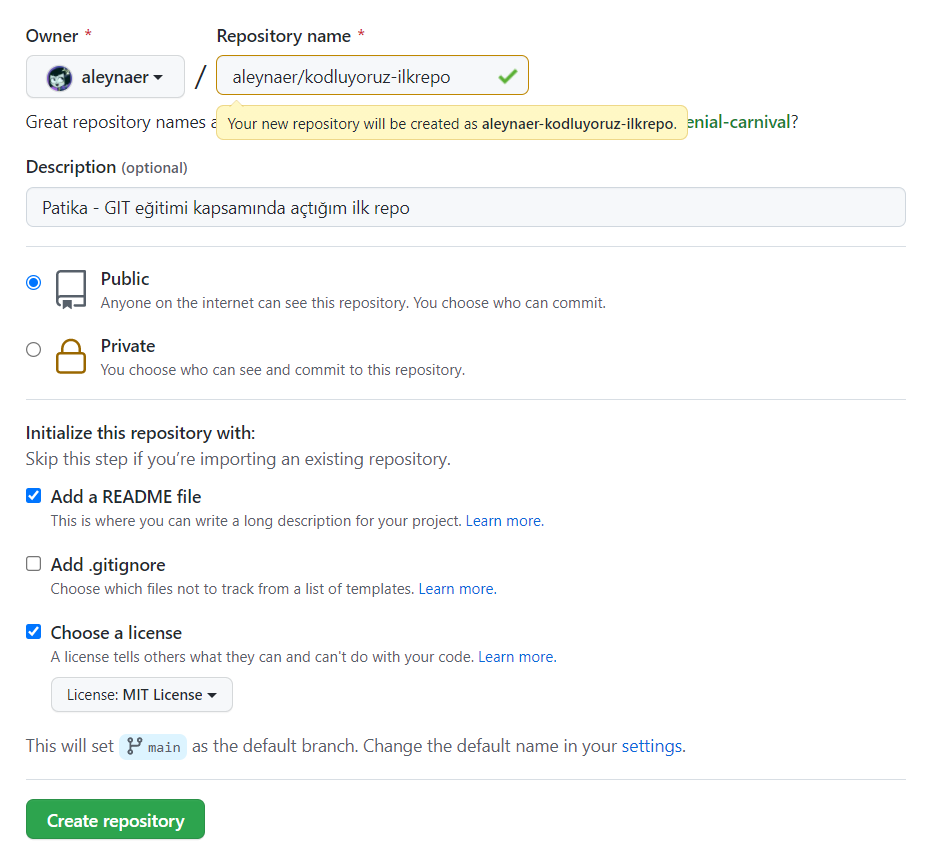

# aleynaer-patika-GIT Eğitimi
Patika - GIT eğitimi kapsamında açtığım ilk repo


Bu repo Patika GIT Eğitiminde oluşturduğumuz ilk repo. İçerisinde bir adet README dosyası, bir adet de index.html barındırıyor.



## Installation

Öncelikle projeyi clonelayın. 

```
git clone https://github.com/aleynaer/aleynaer-kodluyoruz-ilkrepo
```

## Usage

Projeyi cloneladıktan sonra Visual Studio Code programında açınız.

Linux için:

```
cd kodluyoruz-ilkrepo
code .
```

## Contributing 

Pull requestler kabul edilir. Büyük değişiklikler için, lütfen önce neyi değiştirmek istediğinizi tartışmak için bir konu açınız.

## License 

[MIT](https://choosealicense.com/licenses/mit/)